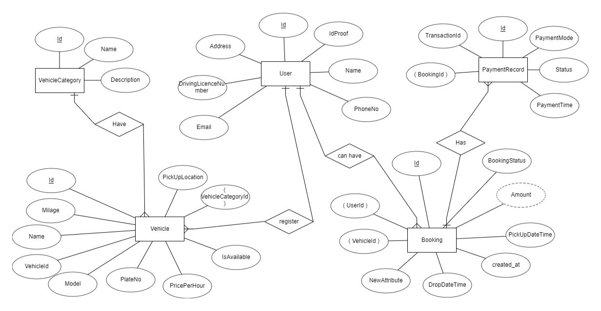

# Car Rental System

## Overview

This Car Rental System is designed to manage the rental of cars and vans. The system uses a MySQL database to store information about vehicles, customers, bookings, payments, and more.

## ER Diagram



## Getting Started

To set up the database and run the project locally, follow these steps:

1. Clone the repository to your local machine:

   ```shell
   git clone https://github.com/yourusername/car-rental.git

2. Navigate to the project directory:

    ```shell
    cd car-rental-system

3. Initialize the database with the necessary tables using the following command at the root level:
    
    ```shell
   flask --app . init_db
   
4. Run the project locally:

    ```shell
    flask --app . run
5. Access the application in your web browser at http://localhost:5000.

## Usage

### User CRUD Operations

#### Create User

- **URL**: `/user/create`
- **Method**: POST
- **Description**: Create a new user in the system.
- **Request Body**: JSON data containing user information (name, phoneNo, address, email, idProof, drivingLicenceNo).
- **Example Request**:
  ```json
  {
    "name": "John Doe",
    "phoneNo": "+1234567890",
    "address": "123 Main St, City",
    "email": "john@example.com",
    "idProof": "<base64_encoded_id_proof>",
    "drivingLicenceNo": "DL123456"
  }
- **Example Response**:
  ```json
  {
    "message": "User created successfully"
  }

#### Get User by ID
- **URL**: /user/get/<user_id>
- **Method**: GET
- **Description**: Retrieve user information by user ID.
- **URL Parameters**: user_id - The ID of the user to retrieve.
- **Example Request**: /user/get/1
- **Example Response**:
    ```json
  {
    "name": "John Doe",
    "phoneNo": "+1234567890",
    "address": "123 Main St, City",
    "email": "john@example.com",
    "idProof": "<base64_encoded_id_proof>",
    "drivingLicenceNo": "DL123456"
  }
 

#### Update User by ID

- **URL**: `/user/update/<user_id>`
- **Method**: PUT
- **Description**: Update user information by user ID.
- **URL Parameters**: 
  - `user_id` (int, required) - The ID of the user to update.
- **Request Body**: JSON data containing updated user information.
- **Example Request**:

  ```json
  PUT /user/update/1
  {
    "name": "Updated Name",
    "phoneNo": "+9876543210",
    "address": "456 Updated St, City",
    "email": "updated@example.com",
    "idProof": "<base64_encoded_updated_id_proof>",
    "drivingLicenceNo": "DL654321"
  }
- **Example Response**:
  ```json
  {
    "message": "User updated successfully"
  }
  
#### Delete User by ID

- **URL**: `/user/delete/<user_id>`
- **Method**: DELETE
- **Description**: Delete a user by user ID.
- **URL Parameters**:
  - `user_id` (int, required) - The ID of the user to delete.
- **Example Request**: /user/delete/1
- **Example Response**:
  ```json
  {
    "message": "User deleted successfully"
  }